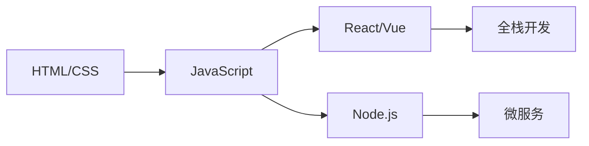

> "选择比努力更重要，但持续学习比选择更重要。"

## 我的2026技术选型

### 🚀 前端框架

| 框架 | 熟悉度 | 应用场景 |
|------|--------|----------|
| React | ⭐⭐⭐⭐⭐ | 大型应用 |
| Vue | ⭐⭐⭐⭐ | 中小型项目 |
| Svelte | ⭐⭐ | 学习中 |

### ⚡ 后端

```
Node.js + Express/NestJS
Python + FastAPI
Go (学习中)
```

### 🛠️ 开发工具

- **编辑器**: VS Code / Cursor
- **版本控制**: Git + GitHub
- **部署**: Cloudflare Pages / Vercel
- **调试**: Chrome DevTools

## 学习路线



## 总结

> "技术是工具，思维是核心。"

持续学习，保持好奇心！
